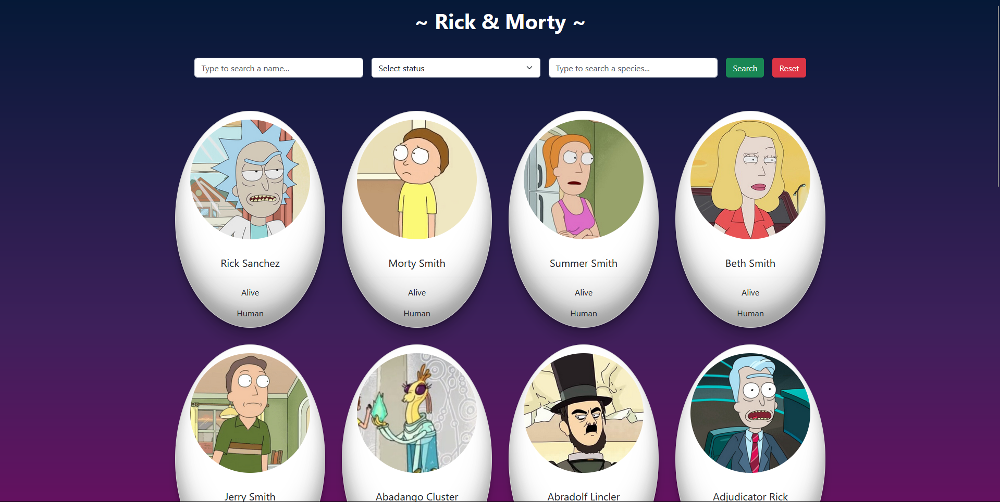

# Rick & Morty Character Finder

Rick & Morty Character Finder è un'applicazione che consente di cercare e filtrare i personaggi della serie Rick & Morty. L'app utilizza l'API Rick and Morty per recuperare i dati sui personaggi e mostrare informazioni dettagliate, come lo stato di vita e la specie.



## Funzionalità principali

- **Ricerca per nome**: Gli utenti possono cercare un personaggio specifico inserendo il nome.
- **Filtri**: Gli utenti possono filtrare i personaggi in base al loro stato di vita (vivo, morto, sconosciuto) e alla specie.
- **Reset dei filtri**: È possibile resettare rapidamente i filtri per visualizzare tutti i personaggi disponibili.
- **Design responsive**: L'interfaccia è ottimizzata per dispositivi mobili e desktop.

## Tecnologie utilizzate

- **Vue.js**: Framework JavaScript progressivo per la costruzione dell'interfaccia utente.
- **Axios**: Libreria per effettuare richieste HTTP per il recupero dei dati dall'API esterna.
- **SCSS**: Utilizzato per stilizzare l'applicazione e rendere il design responsive.
- **API esterna**: I dati dei personaggi sono recuperati tramite chiamate a un'API di terze parti (ad esempio, https://rickandmortyapi.com/api/character).

## Setup del progetto

### Prerequisiti

Assicurati di avere installato Node.js e npm.

### Installazione

1. Clona il repository:

   ```bash
   git clone https://github.com/tuo-username/boolflix.git
   cd boolflix
   ```

2. Clona il repository:

   ```bash
   npm install
   ```

3. Clona il repository:

   ```bash
   VUE_APP_API_KEY=la-tua-api-key
   ```

### Avvio dell'applicazione

Per eseguire il progetto in modalità di sviluppo:

```bash
npm run serve
```
